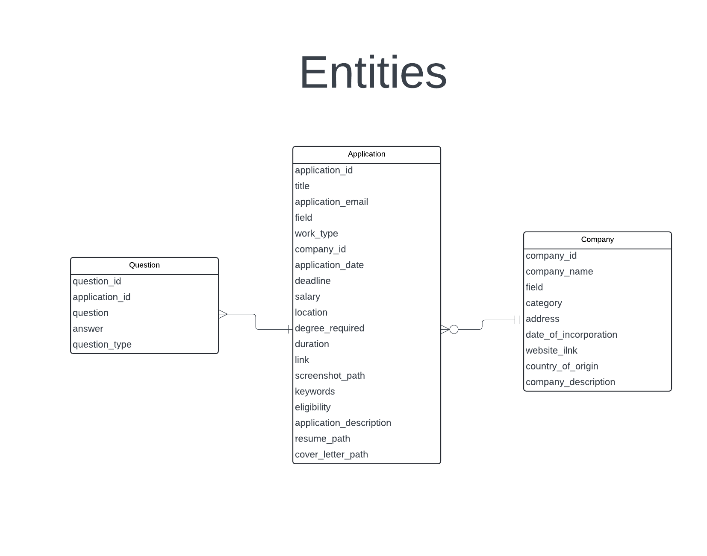
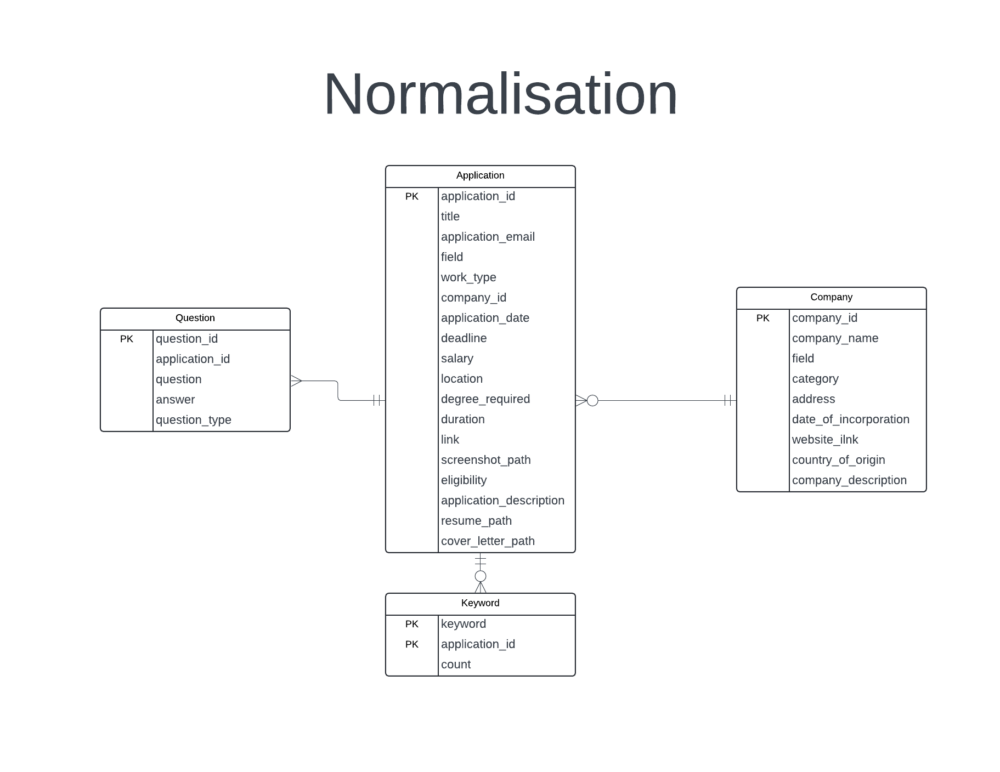
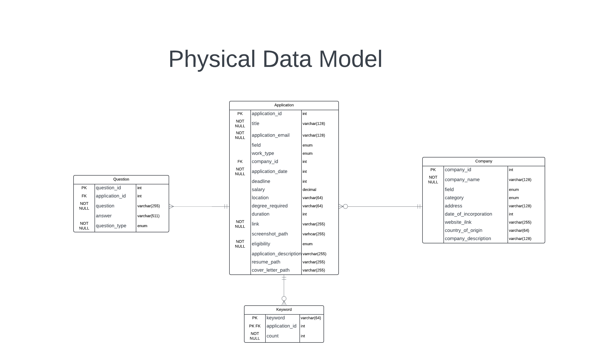

### This file contains the design for the database of this programme
#### Author: Toothless7788

### Note
- There are 3 stages to database design
    1. Requirement Analysis (Identify entities and attributes)
    2. Normalisation
    3. Implementing physical database model


### Requirement Analysis
- #### Requirements
    1. Record each internship application
    2. Record each company
    3. Record each cover letter submitted (To be created later)
    4. Record each CV/Resume submitted (To be created later)
- #### Entities
    1. Application (weak entity to Company)
        - application_id
        - title
        - application_email
        - field (IT/business/Engineering)
        - work_type (internship/full-time/contract)
        - company_id (FK)
        - application_date
        - deadline
        - salary (annually)
        - location
        - degree_required
        - duration (in months)
        - link
        - screenshot_path
        - keywords
        - eligibility
        - application_description
        - resume_path
        - cover_letter_path
    2. Company
        - company_id
        - company_name
        - field (IT/business/Engineering)
        - category (nonprofit/governmental/private)
        - address
        - date_of_incorporation
        - website_link
        - country_of_origin
        - company_description
    3. Question (weak entity to Application)
        - question_id
        - application_id (FK)
        - question
        - answer
        - question_type (MC/text/Checkbox)
    4. CoverLetter (To be created later)
    5. Resume (To be created)
- 

### Normalisation
- Before normalisation, let's add an entity called ```Keyword```, which stores the keyword appeared in an application
- There are multiple stages in normalisation of a database and there will only be 3 changes applied to this database and will give the forms 1NF, 2NF and 3NF
- #### Stage
    1. To 1NF (maintain atomicity of data)
        - N/A
    2. To 2NF (remove partial dependencies)
        - N/A
    3. To 3NF (remove transitive dependencies)
        - N/A
- 


### Physical Database Model
- In this stage, we will add the constraints and data types to each attribute of entities
- 

### Commands
```
# Set up
CREATE DATABASE internshipscraperdb;
CREATE USER 'yourusername'@'localhost' IDENTIFIED BY 'yourpassword';
GRANT ALL PRIVILEGES ON internshipscraperdb.* TO 'yourusername'@'localhost';

# Create tables
DROP TABLE IF EXISTS keyword;
DROP TABLE IF EXISTS question;
DROP TABLE IF EXISTS application;
DROP TABLE IF EXISTS company;

CREATE TABLE Company (
	company_id INT AUTO_INCREMENT, 
    company_name VARCHAR(128) NOT NULL, 
    field ENUM("IT", "BUSINESS", "FINANCE", "GENERAL", "OTHER"), 
    category ENUM("GOVERNMENT", "PRIVATE_LIMITED", "PRIVATE_UNLIMITED", "PUBLIC_LIMITED", "PUBLIC_UNLIMITED", "NGO", "PRO_BONO", "CIC", "RC", "OTHER"), 
    address VARCHAR(128), 
    date_of_incorporation INT UNSIGNED, 
    website_link VARCHAR(255), 
    country_of_origin VARCHAR(64), 
    company_description VARCHAR(128), 
    CONSTRAINT PK_Company PRIMARY KEY (company_id)
);

CREATE TABLE Application (
	application_id INT AUTO_INCREMENT, 
    title VARCHAR(128) NOT NULL, 
    application_email VARCHAR(128) NOT NULL, 
    field ENUM("IT", "BUSINESS", "FINANCE", "GENERAL", "OTHER"), 
    work_type ENUM("INTERNSHIP", "PART_TIME", "FULL_TIME", "CONTRACT", "CASUAL", "SEASONAL", "FREELANCE", "FLEXIBLE", "APPRENTICESHIP"), 
    company_id INT, 
    application_date INT UNSIGNED NOT NULL, 
    deadline INT UNSIGNED, 
    salary DECIMAL(10, 2) UNSIGNED, 
    location VARCHAR(64), 
    degree_required VARCHAR(64), 
    duration INT UNSIGNED, 
    link VARCHAR(255) NOT NULL, 
    screenshot_path VARCHAR(255), 
    eligibility ENUM("ELIGIBLE", "INELIGIBLE") NOT NULL, 
    application_description VARCHAR(255), 
    resume_path VARCHAR(255), 
    cover_letter_path VARCHAR(255), 
    CONSTRAINT PK_Application PRIMARY KEY (application_id), 
    CONSTRAINT FK_Application FOREIGN KEY (company_id) REFERENCES Company(company_id)
);

CREATE TABLE Question (
	question_id INT AUTO_INCREMENT, 
    application_id INT, 
    question VARCHAR(255) NOT NULL, 
    answer VARCHAR(511), 
    question_type ENUM("MC", "CHECKBOX", "TEXT", "DATE", "DROPDOWN", "OTHER") NOT NULL, 
    CONSTRAINT PK_Question PRIMARY KEY (question_id, application_id), 
    CONSTRAINT FK_Question FOREIGN KEY (application_id) REFERENCES Application(application_id)
);

CREATE TABLE Keyword (
	keyword VARCHAR(64), 
    application_id INT, 
    count INT UNSIGNED NOT NULL, 
    CONSTRAINT PK_Keyword PRIMARY KEY (keyword, application_id), 
    CONSTRAINT FK_Keyword FOREIGN KEY (application_id) REFERENCES Application(application_id)
);
```